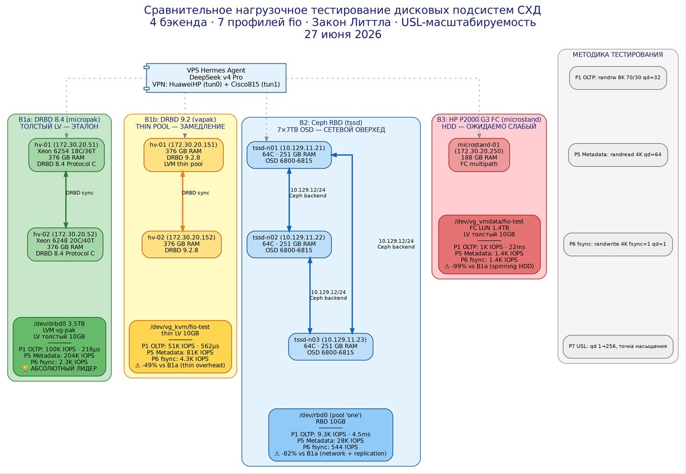

# Нагрузочное тестирование дисковых подсистем СХД

**Дата:** 27 июня 2026
**Исполнитель:** Hermes Agent (DeepSeek v4 Pro)

## Краткие результаты

| Бэкенд | P1 OLTP | P5 Metadata | P6 fsync | Lat P1 |
|--------|---------|-------------|----------|--------|
| **B1a DRBD 8.4 толстый** | **100K IOPS** | **204K IOPS** | 2.3K IOPS | 216μs |
| B1b DRBD 9.2 thin | 51K IOPS | 81K IOPS | 4.3K IOPS | 562μs |
| B2 Ceph RBD | 9.3K IOPS | 28K IOPS | 544 IOPS | 4.5ms |
| B3 HP P2000 FC HDD | 1K IOPS | 1.4K IOPS | 1.4K IOPS | 22ms |

## Структура репозитория

```
├── README.md                 ← этот файл
├── lab-journal.md            ← пошаговый протокол тестирования
├── inventory.md              ← сводная таблица всех узлов
├── hosts/                    ← метаданные каждого узла (CPU, RAM, диски, сеть)
├── scripts/
│   └── test-backend.sh       ← скрипт нагрузочного тестирования (7 профилей fio)
├── results/
│   ├── B1b_DRBD_vapak/       ← результаты DRBD 9.2 (27 JSON)
│   ├── B2_CephRBD_tssd/      ← результаты Ceph RBD (27 JSON)
│   └── B3_HP_P2000_FC/       ← результаты HP P2000 FC (27 JSON)
└── diagrams/
    ├── comparison.dot        ← исходник схемы Graphviz
    ├── comparison.svg        ← векторная схема
    ├── comparison.jpg        ← схема 3500px для печати
    └── comparison.png        ← схема 300 DPI
```

## Как воспроизвести

### Требования

- 4 стенда (см. inventory.md)
- fio 3.35+ на каждом тестовом узле
- Доступ к блочному устройству (LV, RBD, FC LUN)
- SSH-доступ с правами sudo

### Быстрый запуск

```bash
# Клонировать репозиторий
git clone https://github.com/dedvmedved-dot/disk-load-testing-lab.git
cd disk-load-testing-lab

# Запустить тест на нужном бэкенде
sudo bash scripts/test-backend.sh ИМЯ_БЭКЕНДА /dev/ТЕСТОВЫЙ_LV /tmp/fio-results/
```

### Профили нагрузки

| Код | Название | Параметры fio |
|-----|----------|--------------|
| P1 | OLTP | randrw, 8K, 70/30, iodepth=32 |
| P2 | OLAP | rw, 1M, 90/10, numjobs=5, offset_increment=15% |
| P3 | Stream Write | write, 1M, numjobs=5 |
| P4 | Mixed | randrw, 4K-64K, 50/50, iodepth=32 |
| P5 | Metadata | randread, 4K, iodepth=64 |
| P6 | fsync-bound | randwrite, 4K, fsync=1, iodepth=1 |
| P7 | USL | randrw, 8K, 70/30, iodepth=1→256 |

### Схема стенда



Полная версия для печати: [comparison.jpg](diagrams/comparison.jpg) (3500px, 300 DPI) | [SVG](diagrams/comparison.svg)

## Выводы

1. **DRBD 8.4 на толстом LV** — абсолютный лидер (100K IOPS P1, 204K P5)
2. **DRBD 9.2 на thin-pool** — проигрывает 8.4 в 2-10× из-за оверхеда метаданных thin provisioning
3. **Ceph RBD** — медленнее DRBD в 5× (сетевой оверхед + 3x репликация)
4. **HP P2000 G3 HDD** — ожидаемо слабый (1K IOPS), ограничен физикой вращающихся дисков

## Лицензия

MIT
