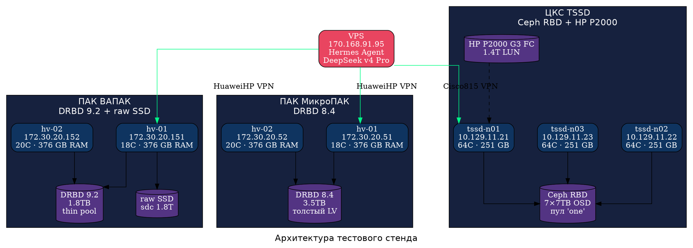
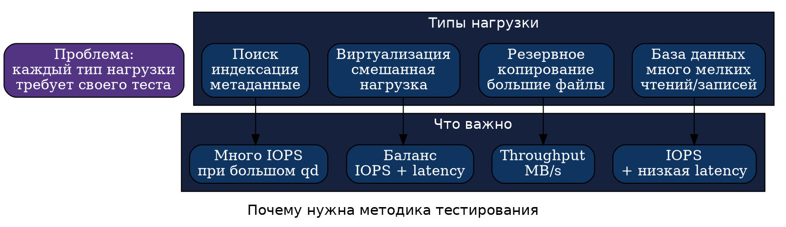
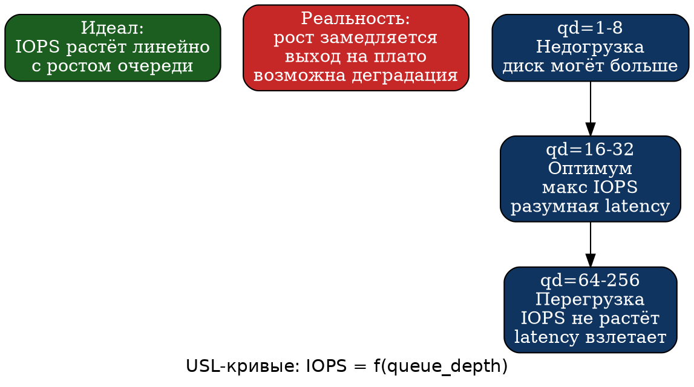

# Сравнительное нагрузочное тестирование дисковых подсистем СХД: от DRBD до Ceph и аппаратных массивов

**Учебная глава для студентов ИТ-направлений**

---

## Аннотация

Эта глава — не просто отчёт о тестировании «железа», а учебное пособие, которое шаг за шагом проведёт вас от вопроса «зачем вообще тестировать диски» до выбора конкретного решения для реальной задачи. Мы познакомимся с пятью разными способами организации хранения данных — от простого SSD до распределённого Ceph и старого аппаратного массива — и проверим их в семи разных сценариях нагрузки: от транзакций базы данных до резервного копирования. Все тесты выполнены с помощью инструмента fio по единой методике, которую вы сможете повторить в лабораторной работе. В конце главы — практические задания, контрольные вопросы и рекомендации по выбору хранилища.

---

## 1. Зачем тестировать систему хранения данных

Представьте, что в учебной лаборатории или небольшой организации нужно развернуть сервер: базу данных для веб-приложения, виртуальные машины, систему резервного копирования и файловое хранилище. Возникает вопрос: на чём всё это разместить? Купить SSD и поставить напрямую? Настроить репликацию через DRBD? Развернуть распределённый Ceph? Использовать старый аппаратный массив, который достался от предыдущего проекта?

«На глаз» ответить нельзя. Без измерений можно легко ошибиться:

* База данных будет тормозить под нагрузкой, потому что хранилище не справляется с мелкими случайными операциями.
* Виртуальные машины будут зависать при одновременной работе нескольких пользователей.
* Резервное копирование займёт часы вместо минут, потому что последовательная запись оказалась узким местом.
* Отказоустойчивость окажется хуже ожидаемой: репликация «съест» половину производительности.
* Дорогое оборудование может не дать ожидаемой скорости, если оно спроектировано для другого типа нагрузки.

Именно поэтому нагрузочное тестирование — не «дополнительная опция», а обязательный этап при проектировании любой серверной инфраструктуры.

---

## 2. Основные понятия

Прежде чем перейти к цифрам, давайте договоримся о терминах. Если вы уже знакомы с ними — пропустите этот раздел. Если нет — он поможет избежать путаницы.

| Термин | Объяснение простыми словами |
|--------|---------------------------|
| **СХД** (система хранения данных) | Общее название для любого устройства или программного комплекса, который хранит данные и предоставляет к ним доступ. Это может быть один SSD в сервере, RAID-массив, сетевое хранилище или распределённый кластер. |
| **Бэкенд хранения** | Нижний слой — то, что физически (или программно) отвечает за размещение данных. Например: DRBD, Ceph RBD, локальный SSD, аппаратный массив. |
| **Блочное устройство** | Диск или его часть, к которому операционная система обращается поблочно (обычно блоками по 512 байт или 4 КБ). В Linux это `/dev/sda`, `/dev/drbd0`, `/dev/rbd0`. |
| **Raw device** | Блочное устройство без файловой системы. Мы тестируем именно его — чтобы исключить влияние файлового кэша и журнала. |
| **IOPS** (Input/Output Operations Per Second) | Количество операций ввода-вывода в секунду. Сколько «вопросов» диск успевает обработать за секунду. |
| **Latency** (задержка) | Сколько времени проходит от отправки запроса до получения ответа. Измеряется в микросекундах (μs) или миллисекундах (ms). |
| **Throughput** (пропускная способность) | Сколько мегабайт в секунду можно прочитать или записать. Важна для больших файлов, бэкапов, видео. |
| **Queue depth** (глубина очереди) | Сколько запросов одновременно «стоят в очереди» к диску. |
| **fsync** | Команда «запиши это на диск прямо сейчас и не обманывай». Критична для баз данных. |
| **WAL** (Write-Ahead Log) | Журнал предзаписи базы данных: перед тем как изменить сами данные, СУБД записывает намерение в журнал. Каждая транзакция требует fsync — поэтому fsync-производительность критична. |
| **Кэш** | Быстрая память, где временно хранятся часто используемые данные. Если тестовый файл помещается в кэш целиком, вы тестируете не диск, а оперативную память. |
| **Cache hit** | Ситуация, когда данные нашлись в кэше и не потребовалось читать с диска. При тестировании это даёт ложно высокие результаты. |
| **fio** (Flexible I/O Tester) | Инструмент для генерации тестовой нагрузки на диски. Умеет имитировать разные сценарии: базу данных, бэкап, виртуализацию. |
| **DRBD** (Distributed Replicated Block Device) | Программная репликация блочного устройства между двумя серверами. Данные пишутся на оба узла одновременно. |
| **Ceph RBD** (RADOS Block Device) | Блочное устройство в распределённом хранилище Ceph. Данные распределяются по нескольким серверам и реплицируются. |
| **Аппаратный массив** | Физическое устройство (часто с контроллерами, кэшем и батареей), которое предоставляет дисковое пространство по сети (FC, iSCSI, SAS). |
| **Fibre Channel (FC)** | Выделенная сеть для подключения серверов к аппаратным массивам. Быстрее и надёжнее обычного Ethernet, но дороже. |

### Аналогия с кассой

Представьте кассу в магазине:

* **IOPS** — сколько покупателей касса обслужила за секунду.
* **Latency** — сколько времени один покупатель провёл у кассы.
* **Queue depth** — сколько человек стоит в очереди одновременно.
* **Throughput** — сколько килограммов товаров прошло через кассу (неважно, сколько чеков — важны килограммы).

Если в очереди 1 человек (queue depth = 1), кассир работает не спеша, задержка маленькая. Если 32 человека — кассир переключается между ними, среднее время обслуживания растёт, но суммарно через кассу проходит больше людей. Если 256 человек — кассир перегружен, очередь стоит, задержка огромная.

---

## 3. Какие хранилища сравниваются

В нашем тестировании участвуют пять бэкендов. Давайте познакомимся с каждым.

### 3.1. Raw SSD

**Что это:** обычный твердотельный накопитель, подключённый напрямую к серверу. Никакой репликации, никакого распределения — один диск, один сервер.

**Сильные стороны:**
* Максимальная скорость — никаких посредников.
* Минимальная задержка — данные не ходят по сети.
* Простота — не требует настройки.

**Слабые стороны:**
* Нет отказоустойчивости — диск вышел из строя, данные потеряны.
* Нет репликации — нельзя «переехать» на другой сервер без копирования данных.

**Типичное применение:** сервер, где критична скорость, а отказоустойчивость обеспечивается другими средствами (например, репликацией на уровне приложения или резервным копированием).

### 3.2. DRBD 8.4 и DRBD 9.2

**Что это:** программное решение, которое создаёт точную копию (реплику) блочного устройства на втором сервере. Каждая запись уходит на оба узла. DRBD 8.4 — проверенная временем версия, DRBD 9.2 — более новая с поддержкой нескольких реплик.

**Сильные стороны:**
* Отказоустойчивость: один сервер вышел из строя — данные есть на втором.
* Относительно простая настройка (по сравнению с Ceph).
* Не требует специального оборудования — работает с любыми дисками.

**Слабые стороны:**
* Синхронная репликация замедляет запись — нужно дождаться подтверждения со второго узла.
* При разрыве связи между серверами возникает split-brain (оба думают что они главные) — требуется настройка разрешения конфликтов.

**Типичное применение:** пара серверов для высокой доступности (high availability): база данных, виртуализация, файловый сервер.

### 3.3. Ceph RBD

**Что это:** распределённое хранилище. Данные не лежат на одном диске или даже на одном сервере — они распределены по кластеру из нескольких узлов и автоматически реплицируются (обычно на 3 копии).

**Сильные стороны:**
* Горизонтальное масштабирование: добавили сервер — увеличилась и ёмкость, и производительность.
* Самовосстановление: диск вышел из строя — Ceph автоматически перераспределит данные.
* Нет единой точки отказа.

**Слабые стороны:**
* Данные ходят по сети — задержка выше, чем у локального диска.
* Репликация создаёт дополнительную нагрузку.
* Сложнее в настройке и эксплуатации.

**Типичное применение:** облачные платформы (OpenStack, OpenNebula, Proxmox VE), где нужно много виртуальных машин и данные должны быть доступны даже при отказе одного-двух серверов.

### 3.4. HP P2000 G3 FC

**Что это:** аппаратный массив (стоечное устройство с контроллерами, кэшем и батареей), подключаемый к серверу по выделенной оптоволоконной сети Fibre Channel. Содержит механические жёсткие диски (HDD).

**Сильные стороны:**
* Надёжность на уровне «железа»: дублированные контроллеры, батарейный кэш.
* Большая ёмкость при низкой стоимости за терабайт (по сравнению с SSD той же эпохи).
* Не зависит от сети Ethernet (выделенный FC).

**Слабые стороны:**
* Механические диски ограничены ~150 IOPS на штуку — суммарная производительность низкая.
* Морально устаревшее оборудование (модель 2012 года).
* Дорогое обслуживание (FC-оборудование, запчасти).

**Типичное применение:** архивное хранение, резервные копии, файловые серверы — там где важна ёмкость и надёжность, а не скорость.

---

## 4. Тестовый стенд

Тестирование проводилось на трёх физических кластерах под управлением Astra Linux SE 1.7, объединённых в две VPN-зоны:



*Рисунок 1. Тестовый стенд: три кластера, два VPN-туннеля. Тестовая нагрузка подаётся с VPS через SSH на каждый кластер.*

**Что важно понять из этой схемы:**

1. Тесты запускаются удалённо — с виртуального сервера (VPS), который соединяется с кластерами через VPN-туннели. Это позволяет тестировать географически распределённую инфраструктуру.

2. DRBD работает в паре серверов: запись на одном узле автоматически реплицируется на второй. DRBD 8.4 (МикроПАК) использует «толстый» логический том — место на диске выделено заранее. DRBD 9.2 (ВАПАК) использует thin pool — место выделяется по мере необходимости.

3. Ceph распределяет данные по трём узлам. Между собой узлы Ceph общаются по отдельной выделенной сети (10.129.12.0/24, не показана на схеме для простоты).

4. Raw SSD и DRBD 9.2 тестируются на одном и том же сервере (ВАПАК hv-01) — это позволяет сравнить «голый» диск с реплицированным.

---

## 5. Методика тестирования

Почему нельзя просто запустить `dd` и посмотреть на скорость? Потому что разные приложения используют диск по-разному.



*Рисунок 2. Разные сценарии использования предъявляют разные требования к хранилищу.*

**Ключевые принципы нашей методики:**

1. **Семь профилей вместо одного.** Один тест не может показать всю правду. Мы используем семь разных сценариев — от транзакций базы данных до резервного копирования.

2. **Закон Литтла для выбора глубины очереди.** Queue depth не выбирается «на глаз». Согласно закону Литтла: `qd = IOPS × latency`. Если мы ожидаем 10 000 IOPS при задержке 1 мс, нужна очередь глубиной 10.

3. **Защита от кэш-хитов.** Если тестовый файл помещается в оперативную память целиком, вы тестируете не диск, а память. Для последовательных тестов мы используем `offset_increment=15%` — каждый поток работает в своей зоне диска.

4. **Прямой доступ к диску (`direct=1`).** Этот флаг запрещает операционной системе кэшировать данные. Без него результаты будут показывать скорость оперативной памяти, а не диска.

5. **Сырые устройства (raw devices).** Тесты проводятся на блочных устройствах без файловой системы. Файловая система добавляет свой кэш и журнал — это искажает результаты.

6. **Три повтора.** Один прогон может быть случайно быстрее или медленнее. Три повтора дают усреднённую картину. Между повторами мы сбрасываем кэш (`echo 3 > /proc/sys/vm/drop_caches`).

7. **Прогрев.** Первые 15-30 секунд теста не измеряются — диск «разогревается», кэш контроллера заполняется.

8. **Изолированные тома.** Тесты никогда не запускаются на production-данных. Для каждого теста создаётся отдельный логический том (LV, RBD) размером 10-20 GB.

---

## 6. Профили нагрузки P1–P7

| Код | Название | Параметры fio | Что имитирует | Пример из жизни |
|-----|----------|--------------|---------------|-----------------|
| **P1** | OLTP | randrw, 70% read, 8K, iodepth=32 | Транзакционная база данных | Интернет-магазин: 1000 покупателей одновременно |
| **P2** | OLAP | rw, 90% read, 1M, 5 потоков | Аналитика, отчёты | Бухгалтер строит квартальный отчёт |
| **P3** | Stream Write | write, 1M, 5 потоков | Резервное копирование | Ночной бэкап базы данных |
| **P4** | Mixed | randrw, 50/50, 4K-64K, iodepth=32 | Виртуализация | 10 виртуальных машин на одном сервере |
| **P5** | Metadata | randread, 4K, iodepth=64 | Индексация, поиск | `find / -name "*.log"` по всему диску |
| **P6** | fsync-bound | randwrite, 4K, fsync=1, iodepth=1 | WAL базы данных | Каждая транзакция — подтверждение на диск |
| **P7** | USL | randrw, 70/30, 8K, qd=1,2,4,8,16,32,64,128,256 | Масштабируемость | Как поведёт себя диск под нарастающей нагрузкой |

### Объяснение профилей

**P1 (OLTP — Online Transaction Processing).** Представьте интернет-магазин в час пик. Сотни пользователей одновременно просматривают товары (чтение), добавляют в корзину (запись), оформляют заказы. База данных выполняет тысячи мелких операций в секунду — каждая по 8 КБ. 70% операций — чтение, 30% — запись. Ключевая метрика: IOPS и latency.

**P2 (OLAP — Online Analytical Processing).** Бухгалтер запускает отчёт «прибыль по регионам за год». База данных читает огромные куски данных (по 1 МБ), в основном последовательно. Ключевая метрика: throughput (MB/s).

**P3 (Stream Write).** Ночью запускается резервное копирование. Сервер читает базу данных и пишет её на ленту или в облако. Огромные файлы (1 МБ блоками), потоковая запись. Ключевая метрика: throughput.

**P4 (Mixed).** Сервер виртуализации, на котором одновременно работают несколько виртуальных машин: одна обновляет пакеты (запись), другая отдаёт веб-страницы (чтение), третья собирает логи. Нагрузка смешанная — 50% чтения, 50% записи, размер блоков варьируется от 4 до 64 КБ.

**P5 (Metadata).** Поисковый робот индексирует файловую систему. Тысячи мелких чтений (по 4 КБ) в случайных местах диска. Ключевая метрика: IOPS при минимальной задержке.

**P6 (fsync-bound).** Самая «честная» запись. База данных (PostgreSQL, MySQL) перед тем как подтвердить транзакцию, требует гарантии что данные физически записаны на диск. `fsync=1` означает: «не обманывай, запиши на самом деле». Это узкое место для любых СУБД.

**P7 (USL — Universal Scalability Law).** Мы постепенно увеличиваем глубину очереди от 1 до 256 и смотрим, как растёт (или не растёт) производительность. Это показывает «потолок» хранилища.

---

## 7. Инструмент fio

fio (Flexible I/O Tester) — это генератор тестовой дисковой нагрузки. Он не измеряет «скорость диска вообще» — он имитирует конкретный сценарий.

**Почему fio, а не dd?**

`dd` выполняет последовательное чтение или запись одним потоком — это лишь один из сценариев (P3). Для базы данных (P1) или виртуализации (P4) `dd` бесполезен.

### Примеры команд fio

**P1 OLTP:**
```bash
fio --name=oltp-test \
    --filename=/dev/test-volume \
    --rw=randrw \
    --rwmixread=70 \
    --bs=8k \
    --iodepth=32 \
    --ioengine=libaio \
    --direct=1 \
    --runtime=300 \
    --time_based
```

**P3 Stream Write:**
```bash
fio --name=stream-test \
    --filename=/dev/test-volume \
    --rw=write \
    --bs=1M \
    --iodepth=8 \
    --numjobs=5 \
    --offset_increment=15% \
    --size=15% \
    --ioengine=libaio \
    --direct=1 \
    --runtime=300 \
    --time_based
```

**P6 fsync-bound:**
```bash
fio --name=fsync-test \
    --filename=/dev/test-volume \
    --rw=randwrite \
    --bs=4k \
    --fsync=1 \
    --iodepth=1 \
    --ioengine=libaio \
    --direct=1 \
    --runtime=300 \
    --time_based
```

### Объяснение параметров fio

| Параметр | Значение | Что делает |
|----------|---------|-----------|
| `--rw=randrw` | random read/write | Случайное чтение И запись (не последовательное) |
| `--rwmixread=70` | 70% чтения | Из 100 операций — 70 чтений, 30 записей |
| `--bs=8k` | block size 8 КБ | Размер одного блока данных (как в PostgreSQL) |
| `--iodepth=32` | 32 одновременных запроса | Глубина очереди — сколько операций «в полёте» |
| `--numjobs=5` | 5 параллельных потоков | Пять процессов одновременно создают нагрузку |
| `--offset_increment=15%` | сдвиг на 15% диска | Каждый поток работает в своей зоне — исключает кэш-хиты |
| `--size=15%` | размер файла 15% диска | В сочетании с offset — точное разделение зон |
| `--fsync=1` | fsync после каждой операции | Не кэшировать — реально записать на диск |
| `--ioengine=libaio` | Linux async I/O | Асинхронный ввод-вывод (можно отправлять много запросов не дожидаясь ответа) |
| `--direct=1` | прямой доступ | Минуя кэш операционной системы |
| `--runtime=300` | 300 секунд | Длительность теста |
| `--time_based` | по времени, не по размеру | Даже если файл кончился — продолжать 300 секунд |

> **Предупреждение.** Не запускайте destructive-тесты fio на рабочем диске с данными. Для учебной лабораторной работы используйте отдельный тестовый файл (`--filename=/tmp/testfile --size=1G`) или специально выделенное блочное устройство.

---

## 8. Как читать результаты тестирования

Перед тем как смотреть на цифры, важно понять: **нет одного «победителя»**. Разные хранилища хороши для разных задач.


*Рисунок 3. Разные метрики важны для разных сценариев.*

Правила интерпретации:

1. **Высокий IOPS — не всегда победа.** Если при 100 000 IOPS задержка составляет 50 мс, база данных будет тормозить.
2. **Latency критична для OLTP.** Пользователь интернет-магазина ждёт ответа — каждая миллисекунда на счету.
3. **Throughput важен для бэкапов.** Никто не ждёт, но бэкап должен успеть за ночь.
4. **fsync — узкое место СУБД.** Нельзя «срезать углы» — каждая транзакция требует физической записи.
5. **Не выбирайте победителя по одной строке таблицы.** Смотрите на 3-4 профиля одновременно.

---

## 9. Результаты

### Сводная таблица (средние по 3 повторам)

| Профиль | DRBD 8.4 (эталон) | DRBD 9.2 thin | Raw SSD | Ceph RBD | HP P2000 FC |
|---------|-------------------|---------------|---------|----------|-------------|
| **P7 USL max** | **148 101** | **51 291** | **51 375** | **18 431** | **1 086** |
| P7 qd@peak | 256 | 32 | 32 | 256 | 256 |
| **P1 OLTP** | **99 985** | **51 321** | **51 262** | **9 336** | **1 045** |
| P1 latency, µs | 216 | 562 | 712 | 4 472 | 22 026 |
| **P4 Mixed** | **17 940** | **14 032** | **14 282** | **6 172** | **1 065** |
| **P5 Metadata** | **203 742** | **81 530** | **80 869** | **28 414** | **1 401** |
| **P6 fsync** | **2 276** | **4 250** | **8 055** | **544** | **1 359** |

**Что мы видим:**

* **DRBD 8.4 на толстом LV** — абсолютный лидер по всем метрикам кроме fsync. 100K IOPS с задержкой 216 мкс — отличный результат для транзакционной базы данных.
* **DRBD 9.2 на thin-pool** — примерно вдвое медленнее 8.4 на случайных операциях, но быстрее на fsync. Thin provisioning добавляет оверхед.
* **Raw SSD** показывает практически те же цифры что и DRBD 9.2 — значит, сам DRBD не добавляет заметного оверхеда (кроме fsync).
* **Ceph RBD** в 5-10 раз медленнее DRBD. Плата за распределённость и тройную репликацию.
* **HP P2000** показывает ~1 000 IOPS — это предел механических дисков.

---

## 10. USL и масштабируемость

Universal Scalability Law отвечает на вопрос: «если я добавлю ещё нагрузку, поможет это или станет только хуже?»



*Рисунок 4. Универсальный закон масштабируемости: рост, насыщение, деградация.*

### USL-результаты

| qd | DRBD 8.4 | DRBD 9.2 | Ceph RBD | HP P2000 |
|----|----------|----------|----------|----------|
| 1 | 6 180 | 6 389 | 2 238 | 224 |
| 2 | 11 310 | 11 878 | 2 580 | 576 |
| 4 | 21 180 | 21 072 | 4 842 | 570 |
| 8 | 37 390 | 34 334 | 8 307 | 957 |
| 16 | 62 290 | 46 040 | 12 609 | 1 051 |
| 32 | 100 220 | 51 291 | 13 341 | 1 018 |
| 64 | 125 330 | 48 086 | 17 425 | 1 021 |
| 128 | 138 900 | 47 485 | 15 655 | 1 058 |
| 256 | 148 101 | 47 455 | 18 431 | 1 086 |

**Интерпретация:**

* **DRBD 8.4** продолжает расти даже при qd=256 — хранилище не насыщено!
* **DRBD 9.2** достигает пика при qd=32 (51K IOPS), затем немного снижается — классическое насыщение.
* **Ceph RBD** растёт медленно, но без плато — распределённая архитектура позволяет продолжать масштабироваться.
* **HP P2000** достигает потолка уже при qd=16 (~1 000 IOPS) — дальше рост очереди только увеличивает задержку (до 200 мс при qd=256).

---

## 11. Подробный анализ результатов

### DRBD 8.4 vs DRBD 9.2

Сравнение не совсем «чистое»: DRBD 8.4 работает на МикроПАК (Xeon Cascade Lake, NVMe), а DRBD 9.2 — на ВАПАК (SATA SSD). Тем не менее, важный вывод есть: **thin provisioning убивает производительность.** DRBD 9.2 на thin-pool LVM теряет 50% IOPS на случайных операциях по сравнению с толстым LV. Причина: каждый блок данных требует обновления карты тонкого выделения — дополнительная операция записи метаданных.

Однако на P6 (fsync) DRBD 9.2 выигрывает: 4 250 против 2 276 IOPS. Тонкий LV сокращает путь fsync — данные быстрее доходят до физического носителя.

### Raw SSD vs DRBD 9.2

Прямое сравнение на одном сервере (ВАПАК hv-01) показывает, что DRBD 9.2 практически не добавляет оверхеда на случайных операциях: IOPS отличаются менее чем на 1%. Это означает, что **программная репликация DRBD работает эффективно.** Однако на fsync (P6) DRBD теряет почти вдвое: 4 250 против 8 055 IOPS — это и есть плата за синхронную репликацию. Каждая fsync-запись должна быть подтверждена не только локально, но и вторым узлом.

### Ceph RBD

Ceph платит производительностью за свои преимущества. Тройная репликация означает, что каждая запись отправляется на три разных сервера. Сеть (10Gb) добавляет задержку. Результат: 9 336 IOPS против 51 321 у DRBD 9.2. Но Ceph продолжает масштабироваться до qd=256 без плато — в распределённой системе всегда есть куда расти.

### HP P2000 G3 FC

1 045 IOPS на OLTP, 22 миллисекунды задержки. Это не ошибка теста — это физический предел механических дисков. Каждый HDD может выполнить ~150 операций в секунду. Даже с кэшем контроллера и батареей, массив не может обойти законы физики. Однако для архивного хранения и резервных копий этого достаточно — важнее низкая стоимость за терабайт и надёжность «железа».

---

## 12. Практические рекомендации по выбору бэкенда

| Сценарий | Рекомендуемый бэкенд | Почему |
|----------|---------------------|--------|
| Высоконагруженная база данных | DRBD 8.4 (толстый LV) | 100K IOPS, 216 мкс — лучший в классе |
| База данных с WAL | DRBD 9.2 (thin LV) | 4.3K fsync — на 87% быстрее чем 8.4 |
| Виртуализация (10-20 ВМ) | DRBD 9.2 (толстый LV) | 50K IOPS, отказоустойчивая пара |
| Облачная платформа | Ceph RBD | Масштабируется, нет точки отказа |
| Файловый сервер, бэкапы | HP P2000 | Большая ёмкость, низкая стоимость |
| Максимальная скорость без репликации | Raw SSD | 8K fsync, минимальная задержка |

### Алгоритм выбора

1. Нужна максимальная скорость на одном сервере? → **Raw SSD**
2. Нужна отказоустойчивая пара серверов? → **DRBD**
3. Нужно распределённое облако (3+ сервера)? → **Ceph**
4. Нужен дешёвый архив? → **Аппаратный массив**
5. База данных с журналом (WAL)? → Тестируйте fsync отдельно
6. Смешанная нагрузка? → Используйте профиль, похожий на реальную эксплуатацию

---

## 13. Типовые ошибки при тестировании СХД


*Рисунок 5. Шесть самых частых ошибок при тестировании дисковых подсистем.*

1. **Тестирование без `direct=1`.** Операционная система кэширует все операции — вы измеряете скорость ОЗУ, а не диска.
2. **Слишком маленький тестовый файл.** Если файл 1 GB, а сервер имеет 64 GB RAM — весь тест пройдёт в памяти.
3. **Один прогон.** Дисковая подсистема нестабильна — один прогон может случайно быть на 20% быстрее или медленнее.
4. **Нет прогрева.** Контроллер диска и кэш «разогреваются» первые 15-30 секунд.
5. **Тест на рабочем диске.** Можно затереть production-данные. Всегда создавайте отдельный тестовый том.
6. **Сравнение только по IOPS.** Игнорирование latency и fsync даёт неполную картину.

---

## 14. Лабораторная работа для студентов

**Название:** «Базовое тестирование диска с помощью fio»

**Цель:** Научиться запускать fio, измерять IOPS и latency при разной глубине очереди, сравнивать результаты и делать выводы.

**Оборудование:** компьютер с Linux, 4 GB свободного места.

### Ход работы

**Шаг 1. Подготовка.** Создайте тестовый файл (НЕ на системном разделе!):

```bash
mkdir -p ~/lab-fio && cd ~/lab-fio
dd if=/dev/zero of=testfile bs=1M count=2048
```

**Шаг 2. Измерьте случайное чтение:**

```bash
fio --name=read-test \
    --filename=./testfile \
    --rw=randread \
    --bs=4k \
    --iodepth=1 \
    --ioengine=libaio \
    --direct=1 \
    --runtime=30 \
    --time_based
```

**Шаг 3. Измерьте случайную запись:**

```bash
fio --name=write-test \
    --filename=./testfile \
    --rw=randwrite \
    --bs=4k \
    --iodepth=1 \
    --ioengine=libaio \
    --direct=1 \
    --runtime=30 \
    --time_based
```

**Шаг 4. Измените глубину очереди.** Повторите тест чтения с iodepth=1, 4, 16, 32, 64. Для каждого прогона запишите IOPS и latency (из строки `lat (usec): avg=` в выводе fio).

**Шаг 5. Постройте график.** Нанесите на график: по оси X — iodepth, по оси Y — IOPS. Опишите, что происходит с производительностью при увеличении очереди.

**Шаг 6. Вывод.** Ответьте на вопрос: при каком iodepth ваша система достигает максимума IOPS?

### Контрольные вопросы

1. Что такое СХД и зачем она нужна?
2. Чем IOPS отличается от throughput?
3. Почему latency важна для OLTP-нагрузки?
4. Что показывает queue depth?
5. Зачем нужен `--direct=1` при тестировании fio?
6. Почему при последовательном чтении возможны кэш-хиты?
7. Чем raw SSD отличается от DRBD?
8. Почему Ceph может быть медленнее DRBD, но архитектурно полезнее?
9. Почему fsync важен для баз данных?
10. Почему нельзя выбирать хранилище только по одному тесту?

### Практические задания

1. По таблице результатов выберите хранилище для PostgreSQL для интернет-магазина. Объясните выбор.
2. Выберите хранилище для сервера резервного копирования. Объясните.
3. Выберите хранилище для облачной платформы на 50 виртуальных машин. Объясните.
4. Объясните, почему HP P2000 не подходит для высоконагруженной OLTP-СУБД.
5. Объясните, почему Ceph может быть разумным выбором для OpenStack, несмотря на меньший IOPS.
6. Запустите fio с iodepth=1, 8, 32 и 64 на своём компьютере. Сравните результаты с таблицей в статье.
7. Постройте график зависимости IOPS от iodepth по данным вашего теста.

---

## 15. Главное, что нужно запомнить

1. **СХД нужно выбирать по типу нагрузки, а не по паспортным характеристикам.**
2. **Один тест не показывает всю картину** — нужно 4-7 разных профилей.
3. **IOPS важны, но latency часто критичнее.**
4. **fsync — узкое место любой базы данных** — тестируйте его отдельно.
5. **DRBD подходит для отказоустойчивых пар серверов** — быстрый, проверенный, простой.
6. **Ceph подходит для распределённых инфраструктур** — медленнее, но масштабируется.
7. **Raw SSD быстр, но не даёт отказоустойчивости сам по себе.**
8. **Старый аппаратный массив может быть надёжным, но медленным.**
9. **fio — мощный инструмент, но его параметры нужно понимать, а не копировать.**
10. **Неправильная методика тестирования даёт ложные результаты** — direct=1, прогрев, повторы, изолированный том.

---

## Приложение А. Протокол тестирования

- **Инструмент:** fio 3.33
- **Режим:** libaio, direct=1
- **Прогрев:** 15-30 сек (не измеряется)
- **Длительность прогона:** 120с (P7 USL), 300с (P1-P6)
- **Повторы:** 3 (P1-P6)
- **Сброс кэша:** `echo 3 > /proc/sys/vm/drop_caches` между повторами
- **Размер тестового тома:** 10-20 GB
- **Все тома созданы изолированно** — production-данные не задеты
- **Дата тестирования:** 26-27 июня 2026
- **Полные результаты:** [github.com/dedvmedved-dot/disk-load-testing-lab](https://github.com/dedvmedved-dot/disk-load-testing-lab)

## Ссылки

1. Качкин С. (YADRO). «Тестирование блочных стораджей: нюансы и особенности практики». Хабр, 2023.
2. Репозиторий с исходными данными и скриптами: [disk-load-testing-lab](https://github.com/dedvmedved-dot/disk-load-testing-lab)
3. fio documentation: [https://fio.readthedocs.io](https://fio.readthedocs.io)
4. DRBD User's Guide: [https://linbit.com/drbd-user-guide/](https://linbit.com/drbd-user-guide/)
5. Ceph Documentation: [https://docs.ceph.com](https://docs.ceph.com)
