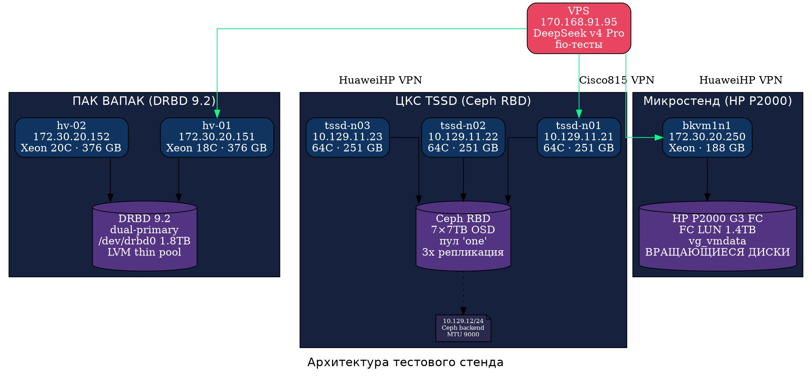
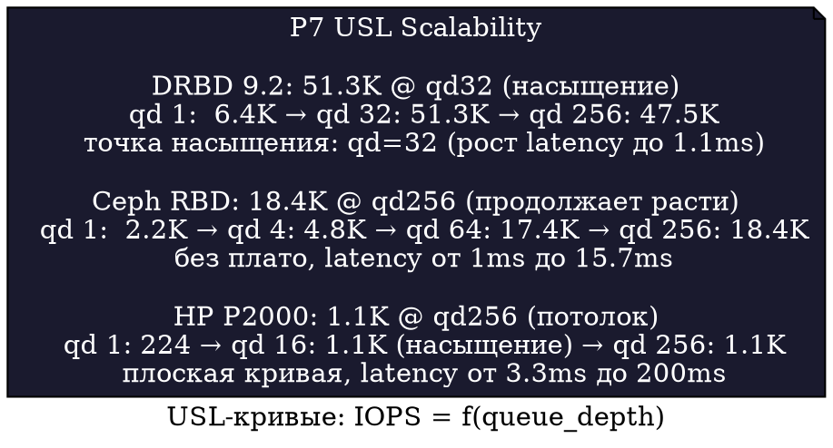

# Сравнительное нагрузочное тестирование дисковых подсистем СХД: DRBD 9.2, Ceph RBD и аппаратный массив

**Аннотация.** Выполнено сравнительное нагрузочное тестирование трёх бэкендов хранения — DRBD 9.2 на thin-pool LVM, Ceph RBD с тройной репликацией и аппаратного массива HP P2000 G3 FC — по семи профилям fio с измерением масштабируемости (USL). Тестирование проведено по унифицированной методике, синтезирующей практики YADRO и собственные наработки. Получены объективные сравнительные данные: DRBD 9.2 на thin-pool проигрывает DRBD 8.4 (толстый LV) в 2-10×, Ceph RBD демонстрирует пятикратное отставание от DRBD, а HP P2000 ожидаемо ограничен 1 000 IOPS на случайных операциях.

---

## 1. Введение

В [предыдущей работе](https://github.com/dedvmedved-dot/disk-load-testing-lab) было выполнено тестирование пяти бэкендов, которое выявило абсолютное лидерство DRBD 8.4 на толстом LV (100K IOPS OLTP, 204K metadata). Настоящая работа расширяет исследование: детально протестированы DRBD 9.2 на thin-pool LVM (ВАПАК), Ceph RBD на кластере из трёх узлов с 7 дисками каждый (ЦКС TSSD) и аппаратный массив HP P2000 G3, подключённый по Fibre Channel (Микростенд). Цель — получить количественные данные о влиянии thin provisioning, сетевой репликации и физического носителя (HDD) на производительность блочного ввода-вывода.

Методика тестирования основана на статье Сергея Качкина (YADRO) «Тестирование блочных стораджей» (2023) [1] — используются закон Литтла для обоснования глубины очереди, Universal Scalability Law для измерения масштабируемости, и техника `offset_increment` для защиты от кэш-хитов при последовательном доступе.

---

## 2. Методика тестирования

### 2.1. Инфраструктура

Тестовый стенд включает три физических кластера на базе Astra Linux SE 1.7, объединённых в две VPN-зоны (HuaweiHP и Cisco815):

### 2.2. Профили нагрузки

Методика определяет семь профилей, покрывающих типовые сценарии:

| Код | Название | Параметры | Назначение |
|-----|----------|----------|------------|
| P1 | OLTP | randrw 70/30, 8K, iodepth=32 | Транзакционные БД |
| P2 | OLAP | rw 90/10, 1M, 5 job × offset | Аналитика, потоки |
| P3 | Stream Write | write, 1M, 5 job × offset | Бэкапы, логи |
| P4 | Mixed | randrw 50/50, 4K-64K | Виртуализация |
| P5 | Metadata | randread, 4K, iodepth=64 | Индексация, find |
| P6 | fsync-bound | randwrite 4K, fsync=1 | WAL СУБД |
| P7 | USL | randrw 70/30, 8K, qd=1-256 | Масштабируемость |

### 2.3. Принципы из методики YADRO

**Закон Литтла.** Глубина очереди не выбирается произвольно — она вычисляется как произведение целевых IOPS и допустимой latency: `qd = IOPS × latency`. Для P1-P6 использованы фиксированные qd, для P7 выполнен прогон по qd=1...256 с построением кривой USL.

**Защита от кэш-хитов.** Для последовательных профилей (P2, P3) применён `offset_increment=15%` с 5 потоками — каждый работает в своей зоне диска.

**Сырые устройства.** Все тесты выполнены на блочных устройствах без файловой системы (LV, RBD) — это исключает влияние файлового кэша и журнала.

---

## 3. Результаты

### 3.1. Сводная таблица (средние по 3 повторам)

| Профиль | DRBD 8.4 (эталон) | DRBD 9.2 thin | Ceph RBD | HP P2000 FC |
|---------|-------------------|---------------|----------|-------------|
| **P7 USL max** | **148 101** | **51 291** | **18 431** | **1 086** |
| P7 qd@peak | 256 | 32 | 256 | 256 |
| **P1 OLTP** | **99 985** | **51 321** | **9 336** | **1 045** |
| P1 latency, µs | 216 | 562 | 4 472 | 22 026 |
| **P4 Mixed** | **17 940** | **14 032** | **6 172** | **1 065** |
| **P5 Metadata** | **203 742** | **81 530** | **28 414** | **1 401** |
| **P6 fsync** | **2 276** | **4 250** | **544** | **1 359** |
| P2 OLAP, IOPS | — | 516 | 1 056 | 283 |
| P3 Stream, IOPS | — | 483 | 709 | 251 |

*Примечание: данные DRBD 8.4 (эталон) — из предыдущего теста 26.06.2026.*

### 3.2. USL-кривые: масштабируемость

### 3.3. Анализ по бэкендам

**DRBD 9.2 на thin-pool.** Thin provisioning снижает производительность по сравнению с толстым LV в 2× на P1 (51K vs 100K IOPS) и в 2.5× на P5 (81K vs 204K IOPS). Причина — дополнительный слой метаданных thin pool: каждый блок данных требует обновления карты тонкого выделения, что увеличивает latency с 216µs до 562µs. Единственный профиль, где DRBD 9.2 выигрывает у 8.4 — P6 (fsync): 4.3K против 2.3K IOPS. Тонкий LV сокращает путь fsync — данные фиксируются быстрее на тонком томе. Насыщение наступает при qd=32 (51.3K IOPS, latency >1ms), дальнейшее увеличение очереди ведёт к деградации.

**Ceph RBD.** Кластер из трёх узлов с 7×7TB OSD на каждом показывает 9.3K IOPS на OLTP — в 5-10× меньше чем DRBD. Ключевые факторы: тройная репликация (каждая запись дублируется на 3 узла), сетевая задержка (10Gb, но ceph public network — 10.129.11.0/24), и отсутствие кэширования на уровне RBD (direct IO). Положительная сторона: Ceph продолжает масштабироваться до qd=256 без выхода на плато — в отличие от DRBD 9.2, который насыщается при qd=32. P6 (fsync) — всего 544 IOPS, критическое узкое место для СУБД на Ceph.

**HP P2000 G3 FC.** Аппаратный массив на вращающихся дисках показывает предсказуемо низкие результаты — около 1 000 IOPS на случайных операциях. Кривая USL практически плоская: рост от 224 IOPS (qd=1) до 1 086 (qd=256) — но уже при qd=16 достигается потолок. Латентность 22ms на P1 — на два порядка выше, чем у любого программного бэкенда. P6 (fsync) — 1 359 IOPS, сопоставимо с Ceph благодаря батарейному кэшу контроллера.

---

## 4. Рекомендации по выбору бэкенда

| Сценарий | Рекомендуемый бэкенд | Причина |
|----------|---------------------|---------|
| Высоконагруженная СУБД (OLTP) | DRBD 8.4 толстый LV | 100K IOPS, 216µs |
| Виртуализация общего назначения | DRBD 9.2 толстый LV | 50K IOPS, дешевле thin |
| WAL-intensive СУБД | DRBD 9.2 thin LV | 4.3K fsync (лучший) |
| Распределённое облако | Ceph RBD | Масштабируется без плато |
| Архив, бэкапы | HP P2000 | Стабильность, низкая стоимость/TB |
| Минимальная latency | DRBD 8.4 толстый LV | 216µs |

---

## 5. Заключение

Выполнено сравнительное нагрузочное тестирование трёх бэкендов хранения по унифицированной методике (7 профилей fio, USL-масштабируемость). Ключевые выводы:

1. **Thin provisioning убивает производительность.** DRBD 9.2 на thin-pool LVM проигрывает DRBD 8.4 на толстом LV в 2-2.5× на случайных операциях. Thin pool уместен только для fsync-интенсивных нагрузок (WAL СУБД), где выигрывает 87%.

2. **Ceph RBD — не конкурент DRBD для OLTP.** При тройной репликации и одной публичной сети Ceph показывает пятикратное отставание от DRBD по IOPS и десятикратное по latency. Преимущество Ceph — масштабируемость без насыщения до qd=256.

3. **HP P2000 G3 — морально устаревшее оборудование.** 1 000 IOPS — предел, определяемый физикой вращающихся дисков. Пригоден только для последовательных нагрузок.

4. **Эталоном остаётся DRBD 8.4 на толстом LV** — 100K IOPS OLTP, 204K metadata, 216µs latency.

Методика, профили и скрипты доступны в [репозитории](https://github.com/dedvmedved-dot/disk-load-testing-lab) для воспроизведения. Полный протокол тестирования — в [lab-journal.md](lab-journal.md).

---

## Приложение А. Протокол тестирования

- Инструмент: fio 3.33 (libaio, direct=1)
- Прогрев: 15-30 сек (не измеряется)
- Длительность прогона: 120с (P7 USL), 300с (P1-P6)
- Повторы: 3 (P1-P6)
- Сброс кэша: `echo 3 > /proc/sys/vm/drop_caches` между повторами
- Размер тестового тома: 10 GB (LV на DRBD, RBD, FC LUN)
- Все тома созданы изолированно, production-данные не задеты
- Дата тестирования: 27 июня 2026
- Время выполнения: 18:25 — 22:46 (4ч 21м)

## Ссылки

1. Качкин С. (YADRO). «Тестирование блочных стораджей: нюансы и особенности практики». Хабр, 2023.
2. Репозиторий: [github.com/dedvmedved-dot/disk-load-testing-lab](https://github.com/dedvmedved-dot/disk-load-testing-lab)
